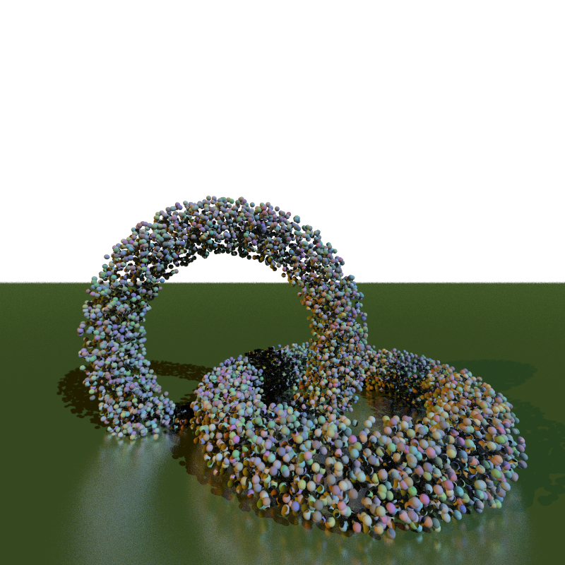
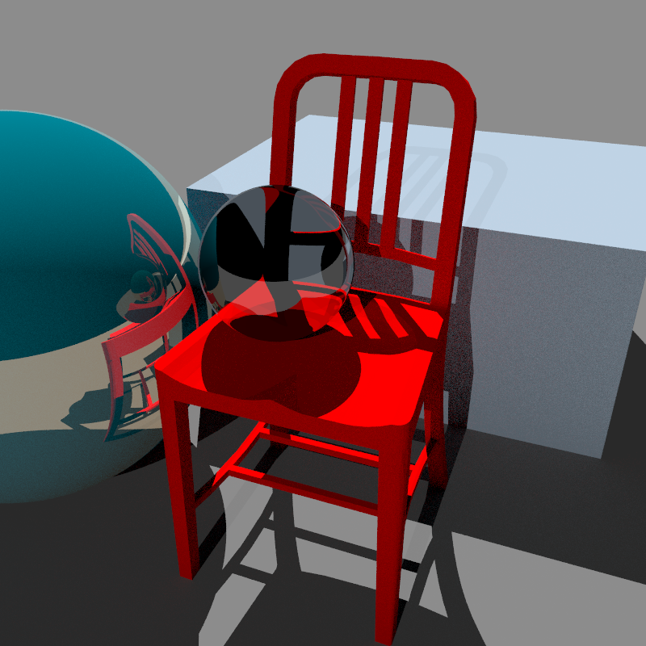

# TinyRaytracer

A simple C++ raytracer implementation with reflection, refraction, texture, global illumination, CPU multi-thread acceleration and BVH support.

The [Doxygen Documentation](https://www.jin3472.com/index.html) is here.

## Roadmap

- [x] Reflection
- [x] Refraction(Transparency)
- [x] Bounding volume hierarchy
- [x] Global illumination
- [x] Doxygen comment support
- [ ] Specular Lighting(Blinn–Phong)
- [ ] GPU-friendly BVH Tree and general data structure
- [ ] CUDA acceleration
- [ ] .obj reader
- [ ] Photon Mapping
- [ ] Glossy specular reflection(BRDF)
- [ ] Denosing
- [ ] More?

> 10,000 spheres, with roughness, depth-of-field, anti-aliasing and shininess. Rendered in 49.196 seconds with an i7-12700kf.(Version 0.1)

> 1,715 triangles using 1,162 vertices, plus two spheres with global illumination, transparency, and reflections. Rendered in 7.564 seconds with an i7-12700kf.(Version 0.1)

## Reference

The base of this project is a MP I wrote for CS418, Interactive Computer Graphics, at the University of Illinois Urbana-Champaign.

[Ray Tracing: The Next Week](https://raytracing.github.io/books/RayTracingTheNextWeek.html)

[CS 418 Interactive Computer Graphics](https://cs418.cs.illinois.edu/website/index.html)

[CS 419 Production Computer Graphics](https://illinois-cs419.github.io/)
